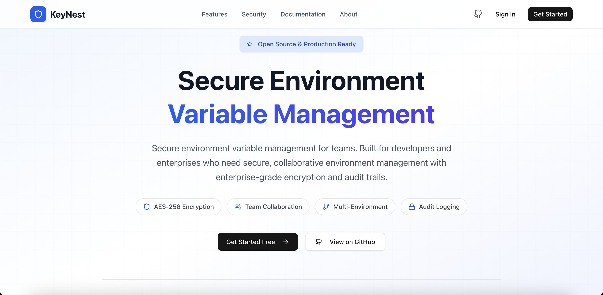

# KeyNest 🔐

**Secure Environment Variable Management for Teams**

KeyNest is a modern, open-source platform for managing environment variables across different projects and environments. Built with security-first principles, it provides encrypted storage, team collaboration, and seamless integration with your development workflow.



## ✨ Features

### 🔒 **Security First**
- **AES-256 Encryption**: All environment variables are encrypted at rest
- **Role-Based Access Control**: Admin, Editor, and Viewer roles
- **JWT Authentication**: Secure token-based authentication
- **Audit Logging**: Complete audit trail of all changes
- **CSRF & CORS Protection**: Enterprise-grade security measures

### 🏢 **Team Collaboration**
- **Organizations**: Organize teams and projects
- **Project Management**: Group environments by project
- **Environment Types**: Development, staging, production, testing
- **Permission Management**: Fine-grained access control
- **Activity Tracking**: See who changed what and when

### 🚀 **Developer Experience**
- **Import/Export**: Seamless .env file integration
- **Search & Filter**: Quickly find variables across projects
- **Copy to Clipboard**: Easy value access with security controls
- **Responsive UI**: Works on desktop and mobile
- **Real-time Updates**: Live synchronization across team members

### 📊 **Management & Monitoring**
- **Dashboard Analytics**: Project and environment statistics
- **Variable Tracking**: Monitor variable usage and changes
- **Team Management**: Add/remove team members with proper roles
- **Export Capabilities**: Generate .env files for deployment

## 🏗 Architecture

```
KeyNest/
├── backend/          # Django REST API
│   ├── authentication/  # User auth & JWT tokens
│   ├── core/            # Main business logic
│   ├── keynest/         # Django project settings
│   └── docker/          # Docker configurations
├── frontend/         # Next.js React application
│   ├── src/
│   │   ├── app/         # Next.js App Router pages
│   │   ├── components/  # Reusable UI components
│   │   ├── lib/         # Utilities and API clients
│   │   └── types/       # TypeScript type definitions
└── docs/            # Documentation and guides
```

## 🚀 Quick Start

### Prerequisites

- **Docker & Docker Compose** (recommended)
- **Node.js 18+** and **Python 3.11+** (for local development)
- **PostgreSQL** and **Redis** (if not using Docker)

### Option 1: Docker (Recommended)

1. **Clone the repository**
   ```bash
   git clone https://github.com/Chitresh-code/KeyNest.git
   cd keynest
   ```

2. **Start the backend services**
   ```bash
   cd backend
   docker compose -f docker-compose.dev.yml up -d
   ```

3. **Start the frontend**
   ```bash
   cd ../frontend
   npm install
   npm run dev
   ```

4. **Access the application**
   - Frontend: http://localhost:3000
   - Backend API: http://localhost:8001
   - API Docs: http://localhost:8001/api/

### Option 2: Local Development

#### Backend Setup

1. **Install dependencies**
   ```bash
   cd backend
   pip install -r requirements.txt
   ```

2. **Configure environment**
   ```bash
   cp .env.example .env
   # Edit .env with your database and Redis configurations
   ```

3. **Run migrations and start server**
   ```bash
   python manage.py migrate
   python manage.py createsuperuser
   python manage.py runserver 8001
   ```

#### Frontend Setup

1. **Install dependencies**
   ```bash
   cd frontend
   npm install
   ```

2. **Configure environment**
   ```bash
   cp .env.local.example .env.local
   # Edit .env.local with your API URL
   ```

3. **Start development server**
   ```bash
   npm run dev
   ```

## 📖 Documentation

### For Users
- [Getting Started Guide](docs/getting-started.md)
- [User Manual](docs/user-guide.md)
- [Security Best Practices](docs/security.md)

### For Developers
- [API Documentation](docs/api.md)
- [Frontend Development](frontend/README.md)
- [Backend Development](backend/README.md)
- [Contributing Guide](CONTRIBUTING.md)

### For Administrators
- [Deployment Guide](docs/deployment.md)
- [Configuration Reference](docs/configuration.md)
- [Backup & Recovery](docs/backup.md)

## 🛠 Technology Stack

### Backend
- **Django 4.2** - Web framework
- **Django REST Framework** - API framework
- **PostgreSQL** - Primary database
- **Redis** - Caching and sessions
- **Cryptography** - AES-256 encryption
- **Docker** - Containerization

### Frontend
- **Next.js 14** - React framework with App Router
- **TypeScript** - Type safety
- **Tailwind CSS** - Styling
- **Shadcn/ui** - UI component library
- **TanStack Query** - Server state management
- **Zustand** - Client state management
- **React Hook Form** - Form handling

## 🤝 Contributing

We welcome contributions from the community! Please see our [Contributing Guide](CONTRIBUTING.md) for details.

### Development Workflow

1. **Fork the repository**
2. **Create a feature branch**
   ```bash
   git checkout -b feature/your-feature-name
   ```
3. **Make your changes**
4. **Add tests** for your changes
5. **Run the test suite**
   ```bash
   # Backend tests
   cd backend && python manage.py test
   
   # Frontend tests
   cd frontend && npm test
   ```
6. **Submit a pull request**

### Code Standards
- Follow existing code style and conventions
- Write tests for new functionality
- Update documentation for user-facing changes
- Use conventional commit messages

## 📝 License

This project is licensed under the MIT License - see the [LICENSE](LICENSE) file for details.

## 🙏 Acknowledgments

- Built with [Django](https://djangoproject.com/) and [Next.js](https://nextjs.org/)
- UI components from [Shadcn/ui](https://ui.shadcn.com/)
- Icons from [Lucide](https://lucide.dev/)
- Inspired by the need for secure, collaborative environment management

## 🐛 Bug Reports & Feature Requests

Please use [GitHub Issues](https://github.com/Chitresh-code/KeyNest/issues) to report bugs or request features.

## 💬 Community & Support

- **GitHub Issues**: Bug reports and feature requests
- **GitHub Discussions**: Questions and community discussions
- **Documentation**: Comprehensive guides and API reference

## 🚀 Deployment

### Production Deployment

KeyNest can be deployed using Docker or traditional hosting:

- **Docker Compose**: Ready-to-use production configuration
- **Kubernetes**: Helm charts available
- **Cloud Providers**: Supports AWS, GCP, Azure deployments
- **Self-Hosted**: Complete deployment flexibility

See our [Deployment Guide](docs/deployment.md) for detailed instructions.

---

**Made with ❤️ by the KeyNest community**

[Website](https://chitresh.in) • [Documentation](https://key-nest-iota.vercel.app) • [GitHub](https://github.com/Chitresh-code/KeyNest)