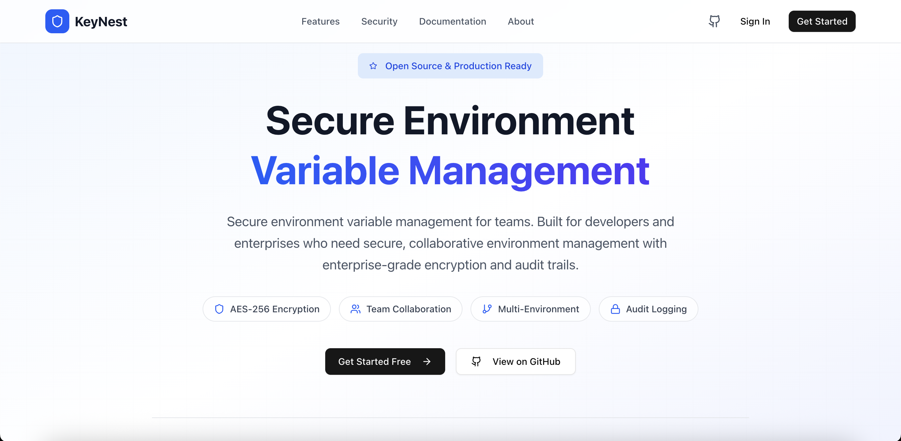

# KeyNest Documentation Wiki

Secure environment variable management for teams. This wiki consolidates architecture, setup, operations, and references for both the backend (Django/DRF) and frontend (Next.js/TypeScript).

---

## Quick Links

- [Getting Started](getting-started.md)
- [User Guide](user-guide.md)
- [API Reference](api.md)
- [Security](security.md)
- [Configuration](configuration.md)
- [Deployment](deployment.md)
- [Backup & Recovery](backup.md)
- [Backend Development](developer-backend.md)
- [Frontend Development](developer-frontend.md)
- [Contributing](contributing.md)
- [Security Policy](security-policy.md)
- [License](license.md)

---

## Overview

KeyNest is an open‑source platform for centrally managing environment variables across projects and environments with encryption at rest, RBAC, audit logging, import/export, and a clean, modern UI.

- Core: Django REST API with FERNet (AES‑256) encryption
- Frontend: Next.js (App Router), TS, Tailwind, shadcn/ui
- Data: PostgreSQL; Cache/Sessions: Redis
- Auth: JWT; Roles: admin, editor, viewer
- Deploy: Docker Compose with optional Nginx, health checks, and backup profile

---

## Architecture

### Authentication Flow

### RBAC and Encryption

---

## Docs Index

- [Introduction](index.md)
- [Getting Started](getting-started.md)
- [User Guide](user-guide.md)
- [API Reference](api.md)
- [Security](security.md)
- [Configuration](configuration.md)
- [Deployment](deployment.md)
- [Backup & Recovery](backup.md)
- [Backend Development](developer-backend.md)
- [Frontend Development](developer-frontend.md)
- [Contributing](contributing.md)
- [Security Policy](security-policy.md)
- [License](license.md)

---

Next: [getting-started.md](getting-started.md)

### Variable Lifecycle

Key backend components:

- authentication: registration, login, JWT
- core: organizations, projects, environments, variables, audit log, encryption utilities
- nginx (optional): reverse proxy, TLS termination for production

Key frontend components:

- src/app: Next.js pages and layouts (auth, dashboard, projects, environments)
- src/components: UI primitives and feature dialogs
- src/lib: API client (Axios), stores (Zustand), helpers, constants

Repository layout (top‑level):

- backend/: Django project, Docker files, Nginx config, scripts
- frontend/: Next.js app with components and libs
- docs/: end‑user, API, and admin docs (this wiki)

---

## Data Model

- User: email‑first auth based on a custom user model
- Organization: top‑level scope for users and projects
- OrganizationMembership: user↔org with role (admin/editor/viewer)
- Project: belongs to an organization; contains environments
- Environment: named scope (development/staging/production/testing)
- EnvVariable: key + encrypted value, unique per environment
- EnvVariableVersion: version history of variable values
- AuditLog: action history including who, when, what, from where

See models in ../backend/core/models.py.

---

## Environments & Configuration

Backend configuration is primarily via environment variables. See full template in ../backend/.env.example.

- SECRET_KEY: Django secret key
- DEBUG: True/False
- ALLOWED_HOSTS: comma‑separated list
- Database: DB_NAME, DB_USER, DB_PASSWORD, DB_HOST, DB_PORT or DATABASE_URL
- Redis: REDIS_URL or CACHE_* vars from Docker configs
- JWT: JWT_SECRET_KEY, JWT_ALGORITHM, token lifetimes
- Encryption: FERNET_KEY (or ENCRYPTION_KEY in Docker configs)
- Email: EMAIL_* vars
- CORS: CORS_ALLOWED_ORIGINS
- Rate limiting: RATE_LIMIT_ENABLED and throttle values
- Logging: LOG_LEVEL
- Uploads: MAX_UPLOAD_SIZE

Frontend configuration:

- NEXT_PUBLIC_API_BASE_URL: API base URL (defaults to http://localhost:8001)

A detailed, copy‑paste friendly list is available here: ./configuration.md

---

## API Overview

- Human‑readable docs: ./api.md
- Source of truth: ../backend/openapi.yaml
- Base URL (dev): http://localhost:8001
- Auth: Token scheme with Authorization: Token <token>
- Key endpoints: /api/auth/*, /api/organizations/, /api/projects/, /api/environments/, /api/variables/, /api/audit-logs/

Use the OpenAPI spec with Swagger UI, Redocly, or codegen to generate clients.

---

## Security Model

- Encryption at rest: EnvVariable.encrypted_value storing FERNet‑encrypted payloads
- RBAC: OrganizationMembership roles control access
- JWT auth: short‑lived access tokens; rotating refresh strongly recommended
- Input validation and CSRF/CORS protections enabled
- Audit logging: all sensitive actions are recorded

See the dedicated guidance: ./security.md and ../SECURITY.md

---

## Local Development

- Quick Start & onboarding: ./getting-started.md
- Backend developer guide: ../backend/README.md
- Frontend developer guide: ../frontend/README.md

Common commands:

- Backend: python manage.py migrate | createsuperuser | runserver 8001 | test
- Frontend: npm install | npm run dev | npm run build | npm run lint
- Docker (dev): docker compose -f backend/docker-compose.dev.yml up -d

---

## Deployment

Recommended: Docker Compose with API, Postgres, Redis, optional Nginx proxy and monitoring.

- Production compose: ../backend/docker-compose.yml
- Dev compose: ../backend/docker-compose.dev.yml
- Nginx config: ../backend/nginx/
- Example deployment notes: ../backend/docker-deployment.md

Full, step‑by‑step instructions and hardening checklist: ./deployment.md

---

## Operations

- Backups: ../backend/scripts/backup.sh or compose backup profile
- DB init: ../backend/scripts/init-db.sql and init-db-dev.sql
- Health checks: /health/ on API and Nginx
- Logs: docker compose logs, API structured logs (LOG_LEVEL)
- Monitoring (optional): Loki, Prometheus profiles in docker‑compose.yml

Operations runbook and examples: ./backup.md

---

## Testing & Quality

- Backend tests: python manage.py test or docker compose exec api python manage.py test
- Frontend tests: npm test (if configured)
- Linting/format: ESLint + Prettier in frontend

PRs should include tests for new logic and update docs for user‑visible changes. See ../CONTRIBUTING.md.

---

## Troubleshooting

- 401 Unauthorized: check token storage and API base URL; browser clears localStorage on logout
- CORS errors: add frontend origin to CORS_ALLOWED_ORIGINS
- Encryption errors: ensure FERNET_KEY/ENCRYPTION_KEY is set and valid
- DB connection refused: verify ports and env values; on dev compose use 5433 externally
- Static files in prod: ensure static_volume/media_volume mounted and Nginx config present

---

## Roadmap (Suggested)

- Variable diff and rollback UI using EnvVariableVersion
- Secret scanning and masked display improvements
- Organization‑level audit exports and webhooks
- SSO integrations (OIDC/SAML)
- Terraform/CLI client for automated provisioning

---

## Glossary

- Environment: named context like development, staging, production
- Variable: key/value pair stored encrypted at rest
- Organization: top‑level grouping for users and projects
- Project: logical application grouping of environments
- RBAC: role‑based access control (admin/editor/viewer)

---

## License & Security

- License: [license.md](license.md) (MIT)
- Security Policy: [security-policy.md](security-policy.md) (how to report vulnerabilities)

---

Maintainers: see APP_CONFIG in [frontend constants](developer-frontend.md) (path: ../frontend/src/lib/constants/index.ts).
